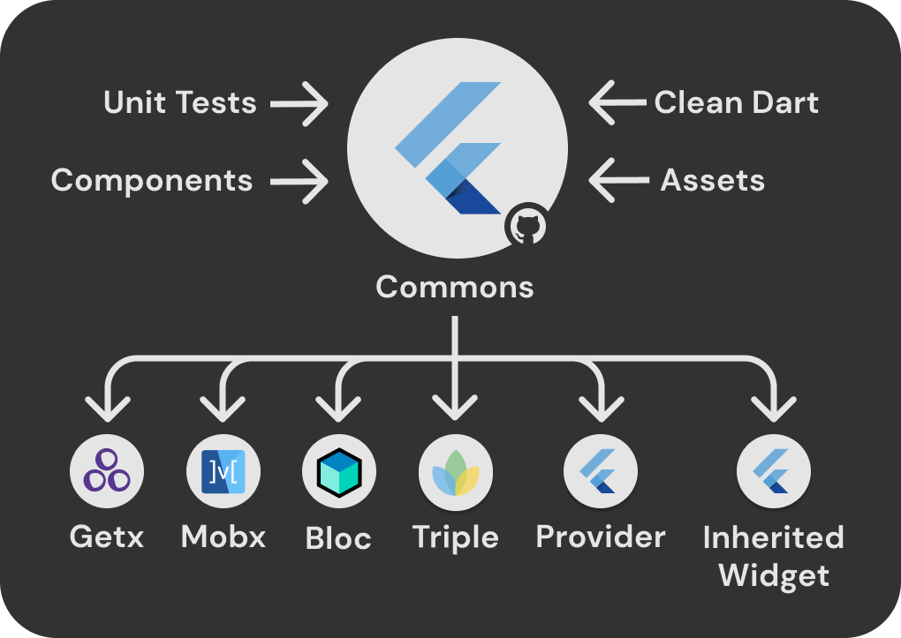

# Flutter Github State Management

This project is a proof of concept to test the [Flutterando](https://github.com/Flutterando) Clean architecture proposal  ([Clean-Dart](https://github.com/Flutterando/Clean-Dart)) with different state managers handling data provided by the API of the Github using Flutter 3.

Overrall, the architecture of the software must follow clear contexts of maintainability and scalability, that being said, it is extremely important to evaluate the architectural structure of the product even before the development, to result in a more versatile application whereupon it improves the ability of the developers to improve or fixing features in a short time.

# 📁 Layers and Structs
Following the Clean Dart principles, we must separate our project into 4 layers: 
1. `Presenter`
2. `Domain` 
3. `Infrastructure` 
4. `External`
 
Highlighting that the `Presenter` layer is responsible for allocating _pages_, _widgets_, _state management_ and that 3 state managers (**_Mobx_**, **_Getx_** and **_Bloc_**) were selected for this POC, it becomes understandable to group `Domain`, `Infra`, `External` layers and their respective _unit tests_ in a single project and create a separate project for each state management approach 

Still with a top-down view, it's possible to notice that as the components of each project will be the same, so we can allocate the widgets in `github_commons` as well.

# 🚀 Github data
The project works with the Github API through the requests:
1. `GET` => https://api.github.com/users/{username}
2. `GET` => https://api.github.com/users/{username}/repos

These 2 requests will be called in `Datasources (External Layer)` receiving data in Json format, being processed in the `Repository (Infra Layer)` now with Model format and converted to Entity format.

As we already have the data available in entities, to allocate them to be worked in `Usecases (Domain Layer)`, therefore, 3 usecases were created:
1. `FindProfile` - get data from the first request flow
2. `FindRepositories` - get data from the second request flow
3. `FindLaguages` - creates statistics with the programming languages used in repositories, by parameter it receives the repositories list fetched in usecase `FindRepositories`

These usecases are called in all projects in which they have their data handled differently and uniquely by each state manager

# 📈 Analysis
| Project        | Layers                  | State Management                                                                                                                                                       | Packages                                                                                             |
|----------------|-------------------------|------------------------------------------------------------------------------------------------------------------------------------------------------------------------|------------------------------------------------------------------------------------------------------|
| `github_mobx`    | Presenter               | `Mobx` - Library for reactively managing the state of your applications. Use the power of observables, actions, and reactions to supercharge your Dart and Flutter apps. | [ mobx ]( https://pub.dev/packages/mobx ), [ flutter_mobx ]( https://pub.dev/packages/flutter_mobx ) |
| `github_getx`    | Presenter               | `Getx` - Open screens/snackbars/dialogs without context, manage states and inject dependencies easily                                                                    | [get](https://pub.dev/packages/get)                                                                  |
| `github_bloc`    | Presenter               | `Bloc` - A predictable state management library that helps implement the Business Logic Component design pattern.                                                        | [bloc](https://pub.dev/packages/bloc), [flutter_bloc](https://pub.dev/packages/bloc)                 |
| `github_commons` | Domain, Infra, External | None                                                                                                                                                                     | [dio](https://pub.dev/packages/dio), [flutter_svg](https://pub.dev/packages/flutter_svg), [equatable](https://pub.dev/packages/equatable), [url_launcher](https://pub.dev/packages/url_launcher), [json_annotation](https://pub.dev/packages/json_annotation), [flutter_modular](https://pub.dev/packages/flutter_modular)  |



Flutter has many other state managers available with different approaches.

[State Management Docs](https://docs.flutter.dev/development/data-and-backend/state-mgmt) | [List of state management approaches](https://docs.flutter.dev/development/data-and-backend/state-mgmt/options)
---

## 📕 Installation
To run this project on your own, do the following: 
- Clone this project.
- Open project `github_commons`  and run `flutter pub get` to install general dependencies.
- Open the project that uses your preferred state manager and run `flutter pub get` to install specific dependencies.
- Run the project using `flutter run` or debugging using your IDE's tools.

# 📁 Versions
```yaml
# Flutter: 3.0.5 
# Dart: 2.17.6 

environment:
  sdk: ">=2.17.6 <3.0.0"
  
dependencies:
  cupertino_icons: ^1.0.2
  dio: 4.0.6
  flutter_svg: 1.1.2
  equatable: 2.0.3
  url_launcher: 6.1.2
  json_annotation: 4.6.0
  flutter_modular: 5.0.3
  mobx: 2.0.7+5
  flutter_mobx: 2.0.6+1
  get: 4.6.5
  bloc: 8.1.0
  flutter_bloc: 8.1.1
```


# 📁 Screen Flow
 

